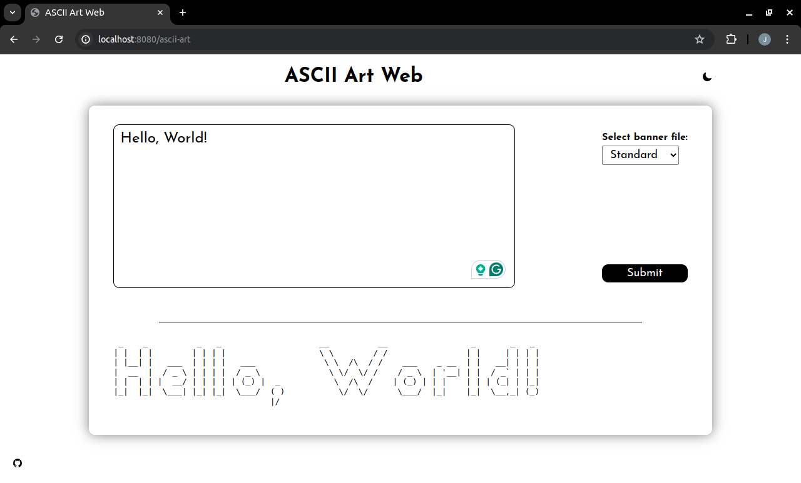
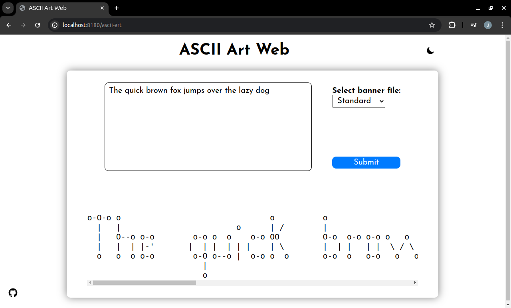

# ASCII-Art-Web

This project consists in creating and running a server, in which it will be possible to use a web GUI (graphical user interface) version of my previous project, ASCII-Art.

## Project Overview



## Getting Started
To get started with the project, download and install Go programming language using the link: https://go.dev/doc/install

## Installation
Clone the repository from its remote location to your local environment with the command below:
```bash
git clone https://github.com/johneliud/ASCII-Art-Web.git
```

Navigate to the project's path
```bash
cd Ascii-Art-Web
```

## Usage
Once in the correct project path, the user needs to specify the port on which the web server will run on in the `serverhandlers.go` file.

NOTE: The specified port should be a number ranging between `1024 to 65535`. This is because other numbers are already reserved.

Run the program with the command below:
```bash
go run . [PORT]
```

From the illustrated example above, our server is running on port `:8180` and can be accessed by accessing the url `http://localhost:8180` on the web browser or clicking on the link using `CTRL + Left Click` combination. The user will be directed to the project's web page.

From this point, the user can interact with the program in a variety of ways including:

- Providing input using the textarea

- Selecting their preferred banner file

- Submitting their input for processing

- Change their preferred display mode e.g light/dark mode

### Examples
Type `The quick brown fox jumps over the lazy dog` in the textarea. Click on the select tag and choose a different banner file e.g Thinkertoy and click on the Submit button. Below should be the expected output.




## Implementation
The project's implementation uses the same implementation of the original ascii-art project. This therefore affects how input passed by the uses is displayed back to them in the mentioned cases below:

Any occurrence of \n present in the input is interpreted as a newline character.

Any occurrence of \t present in the input is interpreted as a tab character.

Occurrences of "\\a", "\\b", "\\v", "\\f", "\\r" or any other character absent in the range of 32 to 126 present in the input will result to an error message displayed to the user.

### HTTP Endpoints
The project uses an HTTP method GET to retrieve users input and uses HTTP method POST to display information from the web server back to the user using the ascii-art path. Incase of any endpoint failure, an HTTP status code will be displayed to the user. Below are some error codes and what may result them:

**200**: Signifies everything went well without any errors.

**404**: Signifies the path being accessed is invalid.

**405**: Signifies the HTTP method being accessed is not allowed.

**500**: Signifies the error being experienced by the user results from an internal error of the program.

## Contact
Feel free to reach out incase of any enquiry in regards to this project via the email address johneliud4@gmail.com
